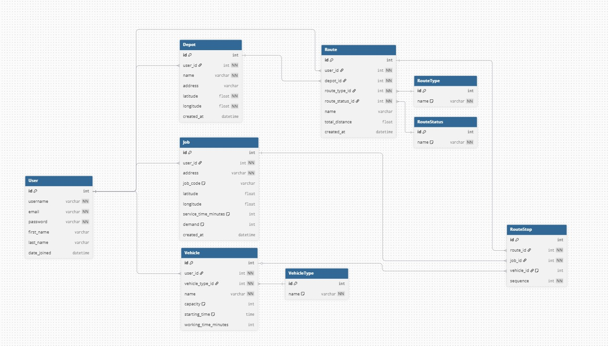

# GeoPlanner — Backend

Django backend for GeoPlanner, a route planning and optimization application.

## What it does

GeoPlanner allows users to manage their own set of locations and solve logistics problems:

- **Geocoding** — batch import of addresses, automatic coordinate lookup via OpenStreetMap (Nominatim)
- **TSP** (Travelling Salesman Problem) — finds the shortest route visiting all selected points
- **VRP** (Vehicle Routing Problem) — assigns jobs to a fleet of vehicles, optimizing total travel cost

Each user has their own private data: depots, jobs, vehicles, and saved routes.

## Database model



### Tables

| Table | Description |
|---|---|
| `Depot` | Starting point (e.g. company warehouse) |
| `Job` | Delivery point / order, reusable across routes |
| `Vehicle` | Fleet vehicle with capacity and working time |
| `Route` | Solved TSP or VRP result |
| `RouteStop` | Ordered stops within a route, with optional vehicle assignment |
| `RouteType` | Dictionary: TSP, VRP |
| `VehicleType` | Dictionary: Van, Truck, Bike, ... |
| `RouteStatus` | Dictionary: Draft, Active, Archived |

## Tech stack

- Python 3.13
- Django 6.x + Django REST Framework
- PostgreSQL
- JWT Authentication (djangorestframework-simplejwt)
- OpenStreetMap / Nominatim (geocoding)
- Frontend: React (separate repository — `geo-planner/FrontEnd`)

## API Endpoints

### Auth
| Method | Endpoint | Description |
|---|---|---|
| POST | `/api/token/` | Login — returns access + refresh JWT |
| POST | `/api/token/refresh/` | Refresh access token |
| POST | `/api/register/` | Register new user |

### Depots
| Method | Endpoint | Description |
|---|---|---|
| GET | `/api/depots/` | List user's depots |
| POST | `/api/depots/` | Create depot |
| GET | `/api/depots/{id}/` | Depot detail |
| PUT/PATCH | `/api/depots/{id}/` | Update depot |
| DELETE | `/api/depots/{id}/` | Delete depot |

### Jobs
| Method | Endpoint | Description |
|---|---|---|
| GET | `/api/jobs/` | List user's jobs |
| POST | `/api/jobs/` | Create job |
| GET | `/api/jobs/{id}/` | Job detail |
| PUT/PATCH | `/api/jobs/{id}/` | Update job |
| DELETE | `/api/jobs/{id}/` | Delete job |

### Vehicles
| Method | Endpoint | Description |
|---|---|---|
| GET | `/api/vehicles/` | List user's vehicles |
| POST | `/api/vehicles/` | Create vehicle |
| GET | `/api/vehicles/{id}/` | Vehicle detail |
| PUT/PATCH | `/api/vehicles/{id}/` | Update vehicle |
| DELETE | `/api/vehicles/{id}/` | Delete vehicle |

### Routes
| Method | Endpoint | Description |
|---|---|---|
| GET | `/api/routes/` | List user's routes |
| POST | `/api/routes/` | Create route (select depot + jobs) |
| GET | `/api/routes/{id}/` | Route detail |
| PATCH | `/api/routes/{id}/` | Update route (e.g. change status) |
| DELETE | `/api/routes/{id}/` | Delete route |
| GET | `/api/routes/{id}/stops/` | Ordered stops for a route |
| POST | `/api/routes/{id}/solve/` | Trigger TSP/VRP algorithm, saves RouteStops |

### Geocoding
| Method | Endpoint | Description |
|---|---|---|
| POST | `/api/geocode/` | Batch geocode list of addresses, returns lat/lon |

### Dictionaries (read-only)
| Method | Endpoint | Description |
|---|---|---|
| GET | `/api/route-types/` | List route types (TSP, VRP) |
| GET | `/api/vehicle-types/` | List vehicle types |
| GET | `/api/route-statuses/` | List route statuses |

## Setup

```bash
# Clone and enter the project
git clone https://github.com/geo-planner/BackEnd.git
cd BackEnd

# Create and activate virtual environment
python -m venv venv
venv\Scripts\Activate.ps1  # Windows
source venv/bin/activate    # Linux/Mac

# Install dependencies
pip install -r requirements.txt

# Configure environment
cp .env.example .env
# Edit .env with your database credentials

# Run migrations
python manage.py migrate

# Create superuser
python manage.py createsuperuser

# Start server
python manage.py runserver
```

## Project structure

```
BackEnd/
├── BackEnd/          # Project configuration (settings, urls)
├── geoplanner/       # Main application
│   ├── models.py     # Database models
│   ├── serializers.py# DRF serializers
│   ├── views.py      # API ViewSets
│   ├── urls.py       # URL routing
│   └── admin.py      # Admin panel configuration
├── docs/
│   └── DB_Model.jpg  # Database diagram
├── requirements.txt
└── manage.py
```
